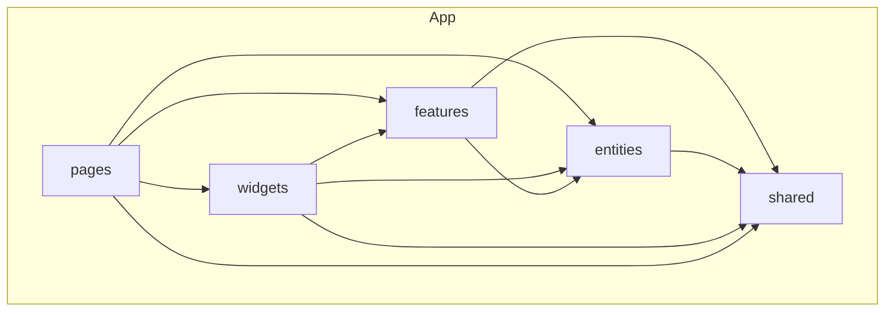

# OpenYield

Desktop app para **análise fundamentalista** de ações: importação de PDFs (relatórios, formulários), enriquecimento com LLM local, busca semântica nos documentos e **valoração** com múltiplos métodos (DCF, Graham, etc.).

Stack principal: **Electron + Vue 3 + TypeScript + Pinia + Tailwind CSS**, organizada com **Feature-Sliced Design (FSD)**.

Repositório: [github.com/marcosdissotti/openyield](https://github.com/marcosdissotti/openyield)

---

## O que o app faz

### Cadernos e PDFs
- Cadernos por ticker/empresa com abas compartilhadas entre áreas do app.
- Drop de PDFs com extração de texto, layout e OCR (Tesseract) quando necessário.
- Markdown enriquecido para consumo por LLM, com preview visual de páginas e gráficos.

### IA local (LM Studio)
- Integração com API OpenAI-compatible (LM Studio na porta 1234 por padrão).
- Relatórios de risco, snapshots de fundamentos e enriquecimento visual de gráficos via modelos de visão.
- Barra de runtime LLM com seleção de modelo e checagem de hardware (VRAM/RAM).

### Busca e persistência
- Índice vetorial local (**Vectra** + embeddings `@xenova/transformers`) para buscar trechos relevantes nos PDFs do caderno.
- Workspace persistido no Electron (`workspace.json`, PDFs em disco, snapshots por caderno).

Detalhes sobre o Vectra, pastas no disco e backup: [Vectra (busca semântica)](#vectra-busca-semântica).

### Valuation
Área dedicada com sidebar de métodos e formulários por técnica:

| Método | Status |
|--------|--------|
| Fluxo de caixa descontado (DCF) | Implementado |
| Graham — LPA + crescimento | Implementado |
| Graham Number — LPA + VPA | Implementado |
| EPV, DDM, EV/EBITDA, P/L justo, Lynch PEG, SOTP | Placeholder (catálogo + tooltips) |

---

## Estrutura do monorepo

```
openyield/                    # raiz npm workspaces
├── apps/
│   └── openyield/            # app Electron + Vue
│       ├── electron/         # processo main (IPC, Vectra, disco)
│       ├── src/              # frontend FSD
│       └── tests/
├── .github/
│   ├── CODEOWNERS
│   └── workflows/release-openyield.yml
└── package.json
```

O código de interface vive em `apps/openyield/src/`. O processo **Electron main** fica em `apps/openyield/electron/` (fora do FSD, pois é runtime Node/Electron).

---

## Feature-Sliced Design (FSD)

O frontend segue [Feature-Sliced Design](https://feature-sliced.design/): camadas horizontais com **dependência só de baixo para cima** (camadas superiores importam inferiores, nunca o contrário).



### Camadas e aliases Vite

| Camada | Alias | Responsabilidade |
|--------|-------|------------------|
| **shared** | `#shared` | Utilitários, tipos comuns, config (pdf.js), UI genérica (`OpenYieldLogo`), logger |
| **entities** | `#entities` | Entidades de negócio + estado Pinia (caderno, PDF, FCD snapshot, relatório, shell) |
| **features** | `#features` | Ações do usuário e lógica de domínio reutilizável (extrair PDF, calcular DCF, persistir DB) |
| **widgets** | `#widgets` | Blocos de UI compostos (shell, preview markdown, tabs, gráficos OCR) |
| **pages** | `#pages` | Composição de telas roteadas pelo shell (`NotebookPage`, `FcdPage`) |

Aliases definidos em `apps/openyield/vite.config.ts`:

```ts
'#shared'   → src/shared
'#entities' → src/entities
'#features' → src/features
'#widgets'  → src/widgets
'#pages'    → src/pages/index.ts
```

### Regras práticas usadas no projeto

1. **`shared`** não importa nada de `entities`, `features`, `widgets` ou `pages`.
2. **`entities`** expõem stores e tipos de uma entidade (ex.: `notebook`, `fcd-snapshot`); sem UI complexa.
3. **`features`** concentram casos de uso: `extract-pdf-rich`, `fcd-calc`, `graham-calc`, `pdf-persistence`, `vector-persistence`.
4. **`widgets`** montam pedaços grandes da interface a partir de features/entities (ex.: `NotebookSourcesShell`).
5. **`pages`** são finas: escolhem widgets e conectam rota/área do app (ex.: `FcdPage` + `ValuationMethodsNav`).

### Exemplo de slice (feature `fcd-calc`)

```
features/fcd-calc/
├── model/fcdTypes.ts          # tipos e IDs de fórmulas
└── lib/
    ├── computeFcdModel.ts     # motor de cálculo
    ├── fcdFormulas.ts           # definições das células (espelho Excel)
    └── normalizeFcdInputs.ts  # normalização de inputs
```

A UI da página Valuation (`pages/fcd/ui/`) consome essa feature; a persistência fica em `entities/fcd-snapshot` + `features/pdf-persistence`.

### Public API por slice

Cada entity/feature expõe um `index.ts` na raiz do slice (ex.: `#entities/notebook`, `#features/fcd-calc/...`). Imports entre camadas usam esses entry points ou subpaths estáveis, evitando acoplamento a arquivos internos.

---

## Desenvolvimento

### Pré-requisitos

- **Node.js 24.11+** (requerido por `vectra`; ver `.nvmrc`)
- **npm** (workspaces na raiz)
- Para IA local: [LM Studio](https://lmstudio.ai/) com servidor API ativo

### Instalação

```bash
git clone https://github.com/marcosdissotti/openyield.git
cd openyield
npm install
```

### Variáveis de ambiente

Copie o exemplo e ajuste se necessário:

```bash
cp apps/openyield/.env.example apps/openyield/.env
```

### Scripts (raiz do monorepo)

| Comando | Descrição |
|---------|-----------|
| `npm run dev:openyield` | Electron + Vite (desktop) |
| `npm run dev:openyield:web` | Só frontend no browser (`VITE_WEB_ONLY=1`) |
| `npm run test:openyield` | Testes unitários (Vitest) |
| `npm run e2e:openyield` | Integração PDF drop |
| `npm run dist:openyield:win` | Build portable `.exe` (Windows x64) |

Build Linux/macOS (dentro do workspace):

```bash
npm run dist:electron:linux -w openyield
npm run dist:electron:mac -w openyield
```

---

## Electron e bridge `openYieldElectron`

No desktop, o preload expõe `window.openYieldElectron` com:

- Controles de janela (minimize, maximize, close)
- IPC de workspace (`pdfDbLoadWorkspace`, persistência de PDFs, relatórios, fundamentos, FCD)
- Busca vetorial (`vectorBuscarChunksNotebook`, etc.)
- Resumo de hardware

Tipos em `apps/openyield/env.d.ts` e implementação em `apps/openyield/electron/preload.ts`.

---

## Vectra (busca semântica)

O OpenYield usa [Vectra](https://github.com/Stevenic/vectra) como **índice vetorial local** no processo Electron. Cada PDF importado é dividido em chunks (por página/seção); cada chunk recebe um embedding do modelo **`Xenova/all-MiniLM-L6-v2`** (`@xenova/transformers`) e fica pesquisável por similaridade.

### Para que serve no app

- **Chat do caderno** — ao fazer perguntas, o app busca os chunks mais relevantes do notebook ativo (`vectorBuscarChunksNotebook`).
- **Relatórios do Estúdio** (riscos, fundamentos, etc.) — recuperam contexto dos PDFs antes de chamar o LLM.
- **Indexação automática** — ao carregar PDFs, o main process persiste texto, metadados e vetores (`vectorGarantirChunksNotebook`).

Não há UI separada do Vectra: o acesso é **via app** (chat/estúdio) ou **direto nos ficheiros** abaixo.

### Onde ficam os dados no disco

Tudo vive em `{userData}/vectra/`, onde `userData` é a pasta de dados do Electron para o OpenYield:

| SO | Caminho típico |
|----|----------------|
| **Windows** | `%APPDATA%\openyield\vectra\` |
| **Linux / WSL** | `~/.config/openyield/vectra/` |
| **macOS** | `~/Library/Application Support/openyield/vectra/` |

Instalação antiga (**pdf-sources**): mesma estrutura em `%APPDATA%\pdf-sources\` ou `~/.config/pdf-sources/`. Na primeira arrancada, o app tenta [migrar automaticamente](apps/openyield/electron/migrateLegacyUserData.ts) se o workspace novo estiver vazio.

### Estrutura da pasta `vectra/`

```
vectra/
├── workspace.json      # cadernos, relatórios, fundamentos, snapshots FCD (metadados)
├── pdfs/               # PDFs originais (ficheiros nomeados por SHA-256)
└── documents/          # índice Vectra (vetores + metadados por chunk)
```

Cache do modelo de embeddings (separado):

| SO | Caminho |
|----|---------|
| Windows | `%APPDATA%\openyield\transformers-cache\` |
| Linux | `~/.config/openyield/transformers-cache/` |
| macOS | `~/Library/Application Support/openyield/transformers-cache/` |

### Como aceder / inspecionar

1. **Pelo app (uso normal)** — importe PDFs no caderno e use o chat ou ferramentas do Estúdio; a busca vetorial corre em background.
2. **Log de arranque** — ao abrir o desktop, o main process regista no terminal:
   `[openyield] App iniciado. Índice Vectra em: …/vectra/documents`
   (em dev: consola onde corre `npm run dev:openyield`; build: Developer Logs se disponível).
3. **Ficheiros** — abra `workspace.json` para ver cadernos/relatórios; a pasta `documents/` é o índice Vectra (não editar manualmente enquanto o app estiver aberto).
4. **Backup** — copie a pasta `vectra/` inteira (com o app fechado) para preservar PDFs, índice e metadados.

### Código relevante

| Peça | Local |
|------|--------|
| Serviço Vectra + embeddings | `apps/openyield/electron/vectorService.ts` |
| IPC / preload | `apps/openyield/electron/vectorIpc.ts`, `preload.ts` |
| Cliente no frontend | `apps/openyield/src/features/vector-persistence/lib/vectorClient.ts` |

A API exposta ao renderer inclui `vectorBuscar`, `vectorBuscarChunksNotebook`, `vectorGarantirChunksNotebook` e `pdfDbLoadWorkspace` (workspace completo).

---

## Testes

```bash
npm run test:openyield
```

- **Vitest** + **happy-dom** para unitários em `apps/openyield/tests/unit/`
- Integração: `tests/integration/pdf-drop-flow.spec.ts`
- **Cypress** disponível para E2E web (`npm run e2e:cypress -w openyield`)

---

## Releases

O workflow **Release OpenYield** corre em cada push para `main`, mas **só gera `.exe` e publica release** quando a `version` em `apps/openyield/package.json` é **maior** que a última release no GitHub.

Para publicar uma nova build:

1. Incremente `"version"` em `apps/openyield/package.json` (ex.: `0.0.1` → `0.0.2`)
2. Commit + push para `main`
3. A release aparece com tag `v{versão}` (ex.: `v0.0.2`)

Releases: [github.com/marcosdissotti/openyield/releases](https://github.com/marcosdissotti/openyield/releases)

A versão também aparece na barra de título do app (`OpenYield — 0.0.1`).

---

## Licença

[MIT](LICENSE) — Copyright (c) 2025 OpenYield
