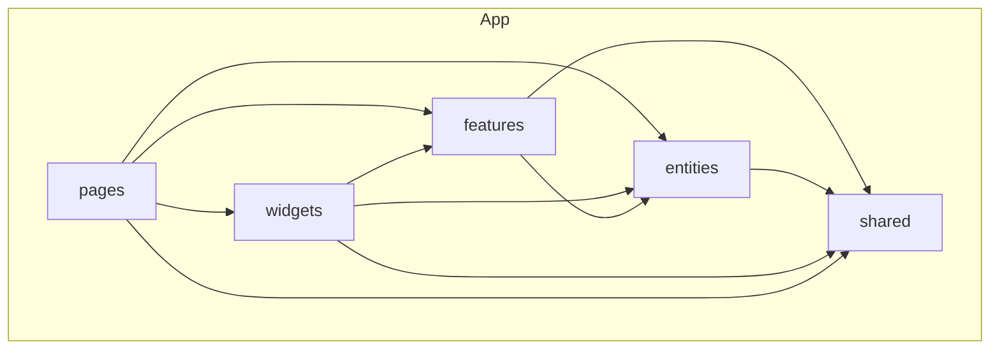

# OpenYield

Desktop app para **análise fundamentalista** de ações: importação de PDFs (relatórios, formulários), enriquecimento com LLM local, busca semântica nos documentos e **valoração** com múltiplos métodos (DCF, Graham, etc.).

Stack principal: **Electron + Vue 3 + TypeScript + Pinia + Tailwind CSS**, organizada com **Feature-Sliced Design (FSD)**.

Repositório: [github.com/marcosdissotti/openyield](https://github.com/marcosdissotti/openyield)

---

## O que o app faz

### Cadernos e PDFs
- Cadernos por ticker/empresa com abas compartilhadas entre áreas do app.
- Drop de PDFs com extração de texto, layout e OCR (Tesseract) quando necessário.
- Markdown enriquecido para consumo por LLM, com preview visual de páginas e gráficos.

### IA local (LM Studio)
- Integração com API OpenAI-compatible (LM Studio na porta 1234 por padrão).
- Relatórios de risco, snapshots de fundamentos e enriquecimento visual de gráficos via modelos de visão.
- Barra de runtime LLM com seleção de modelo e checagem de hardware (VRAM/RAM).

### Busca e persistência
- Índice vetorial local (**Vectra** + embeddings `@xenova/transformers`) para buscar trechos relevantes nos PDFs do caderno.
- Workspace persistido no Electron (`workspace.json`, PDFs em disco, snapshots por caderno).

### Valuation
Área dedicada com sidebar de métodos e formulários por técnica:

| Método | Status |
|--------|--------|
| Fluxo de caixa descontado (DCF) | Implementado |
| Graham — LPA + crescimento | Implementado |
| Graham Number — LPA + VPA | Implementado |
| EPV, DDM, EV/EBITDA, P/L justo, Lynch PEG, SOTP | Placeholder (catálogo + tooltips) |

---

## Estrutura do monorepo

```
openyield/                    # raiz npm workspaces
├── apps/
│   └── openyield/            # app Electron + Vue
│       ├── electron/         # processo main (IPC, Vectra, disco)
│       ├── src/              # frontend FSD
│       └── tests/
├── .github/
│   ├── CODEOWNERS
│   └── workflows/release-openyield.yml
└── package.json
```

O código de interface vive em `apps/openyield/src/`. O processo **Electron main** fica em `apps/openyield/electron/` (fora do FSD, pois é runtime Node/Electron).

---

## Feature-Sliced Design (FSD)

O frontend segue [Feature-Sliced Design](https://feature-sliced.design/): camadas horizontais com **dependência só de baixo para cima** (camadas superiores importam inferiores, nunca o contrário).



### Camadas e aliases Vite

| Camada | Alias | Responsabilidade |
|--------|-------|------------------|
| **shared** | `#shared` | Utilitários, tipos comuns, config (pdf.js), UI genérica (`OpenYieldLogo`), logger |
| **entities** | `#entities` | Entidades de negócio + estado Pinia (caderno, PDF, FCD snapshot, relatório, shell) |
| **features** | `#features` | Ações do usuário e lógica de domínio reutilizável (extrair PDF, calcular DCF, persistir DB) |
| **widgets** | `#widgets` | Blocos de UI compostos (shell, preview markdown, tabs, gráficos OCR) |
| **pages** | `#pages` | Composição de telas roteadas pelo shell (`NotebookPage`, `FcdPage`) |

Aliases definidos em `apps/openyield/vite.config.ts`:

```ts
'#shared'   → src/shared
'#entities' → src/entities
'#features' → src/features
'#widgets'  → src/widgets
'#pages'    → src/pages/index.ts
```

### Regras práticas usadas no projeto

1. **`shared`** não importa nada de `entities`, `features`, `widgets` ou `pages`.
2. **`entities`** expõem stores e tipos de uma entidade (ex.: `notebook`, `fcd-snapshot`); sem UI complexa.
3. **`features`** concentram casos de uso: `extract-pdf-rich`, `fcd-calc`, `graham-calc`, `pdf-persistence`, `vector-persistence`.
4. **`widgets`** montam pedaços grandes da interface a partir de features/entities (ex.: `NotebookSourcesShell`).
5. **`pages`** são finas: escolhem widgets e conectam rota/área do app (ex.: `FcdPage` + `ValuationMethodsNav`).

### Exemplo de slice (feature `fcd-calc`)

```
features/fcd-calc/
├── model/fcdTypes.ts          # tipos e IDs de fórmulas
└── lib/
    ├── computeFcdModel.ts     # motor de cálculo
    ├── fcdFormulas.ts           # definições das células (espelho Excel)
    └── normalizeFcdInputs.ts  # normalização de inputs
```

A UI da página Valuation (`pages/fcd/ui/`) consome essa feature; a persistência fica em `entities/fcd-snapshot` + `features/pdf-persistence`.

### Public API por slice

Cada entity/feature expõe um `index.ts` na raiz do slice (ex.: `#entities/notebook`, `#features/fcd-calc/...`). Imports entre camadas usam esses entry points ou subpaths estáveis, evitando acoplamento a arquivos internos.

---

## Desenvolvimento

### Pré-requisitos

- **Node.js 22+** (requerido por `vectra`)
- **npm** (workspaces na raiz)
- Para IA local: [LM Studio](https://lmstudio.ai/) com servidor API ativo

### Instalação

```bash
git clone https://github.com/marcosdissotti/openyield.git
cd openyield
npm install
```

### Variáveis de ambiente

Copie o exemplo e ajuste se necessário:

```bash
cp apps/openyield/.env.example apps/openyield/.env
```

### Scripts (raiz do monorepo)

| Comando | Descrição |
|---------|-----------|
| `npm run dev:openyield` | Electron + Vite (desktop) |
| `npm run dev:openyield:web` | Só frontend no browser (`VITE_WEB_ONLY=1`) |
| `npm run test:openyield` | Testes unitários (Vitest) |
| `npm run e2e:openyield` | Integração PDF drop |
| `npm run dist:openyield:win` | Build portable `.exe` (Windows x64) |

Build Linux/macOS (dentro do workspace):

```bash
npm run dist:electron:linux -w openyield
npm run dist:electron:mac -w openyield
```

---

## Electron e bridge `openYieldElectron`

No desktop, o preload expõe `window.openYieldElectron` com:

- Controles de janela (minimize, maximize, close)
- IPC de workspace (`pdfDbLoadWorkspace`, persistência de PDFs, relatórios, fundamentos, FCD)
- Busca vetorial (`vectorBuscarChunksNotebook`, etc.)
- Resumo de hardware

Tipos em `apps/openyield/env.d.ts` e implementação em `apps/openyield/electron/preload.ts`.

---

## Testes

```bash
npm run test:openyield
```

- **Vitest** + **happy-dom** para unitários em `apps/openyield/tests/unit/`
- Integração: `tests/integration/pdf-drop-flow.spec.ts`
- **Cypress** disponível para E2E web (`npm run e2e:cypress -w openyield`)

---

## Releases

Cada push para `main` dispara o workflow **Release OpenYield** (`.github/workflows/release-openyield.yml`):

1. Build Windows portable no GitHub Actions
2. Cria release com tag `v{versão}-build.{n}`
3. Anexa o `.exe` para download

Releases: [github.com/marcosdissotti/openyield/releases](https://github.com/marcosdissotti/openyield/releases)

Versão do app: `apps/openyield/package.json` → campo `version`.

---

## Licença

[MIT](LICENSE) — Copyright (c) 2025 OpenYield
